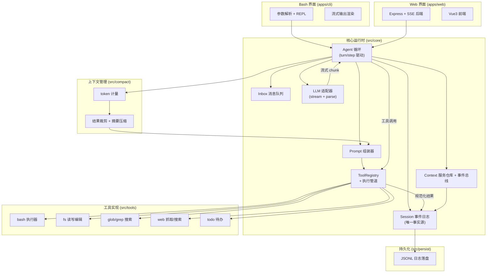
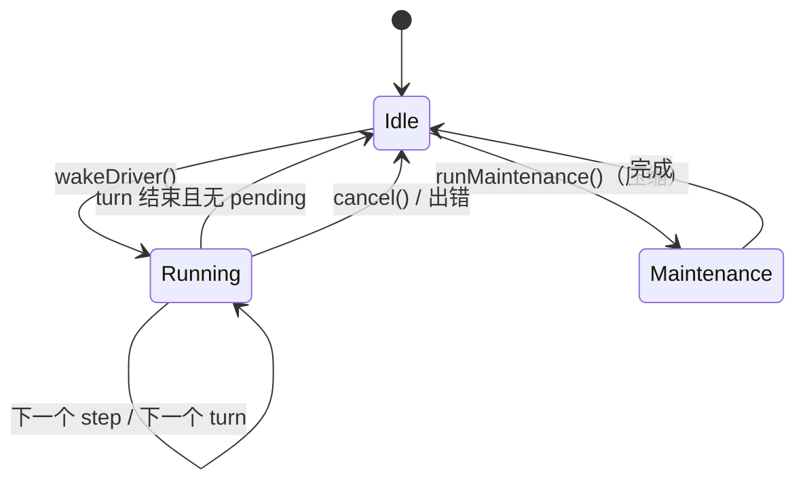
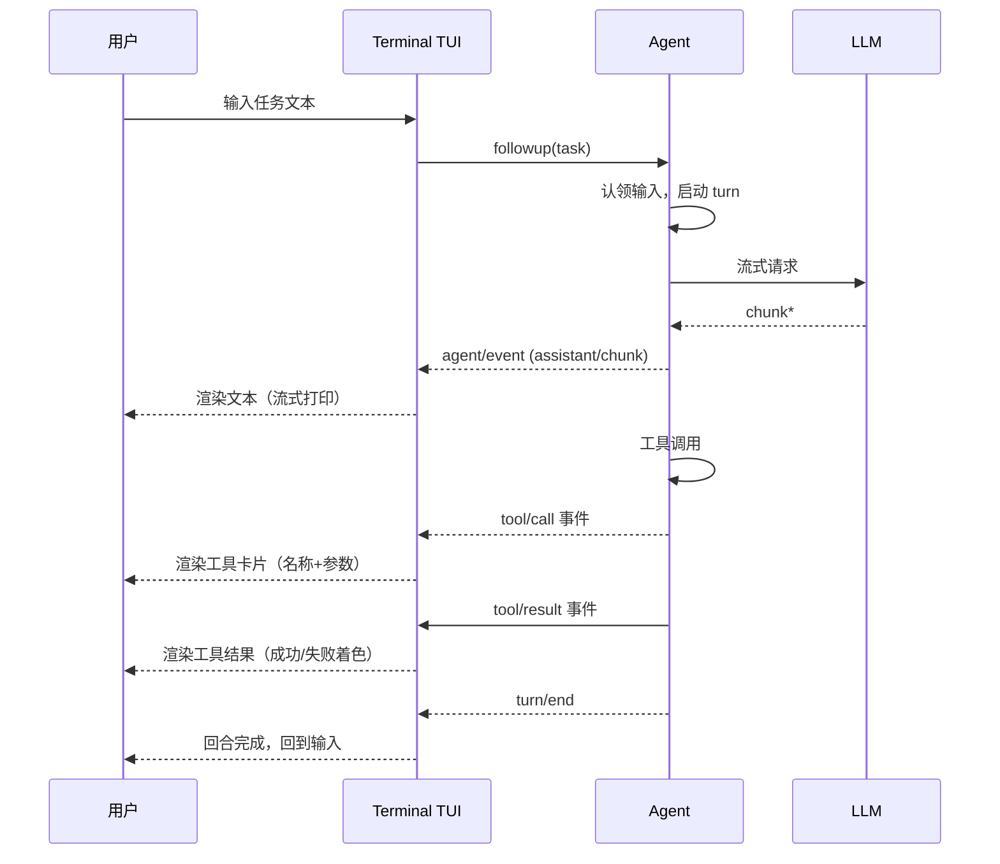
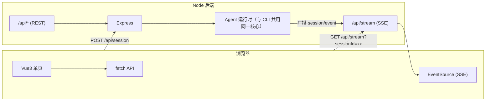

# Spark Code — 编程智能体技术方案与完整规格（Spec）

> 项目：软件工程专业推免考核 — 个人独立设计并实现的编程智能体
> 语言：TypeScript / Node.js　|　模型：OpenAI 兼容 API + 原生 tool calling
> 设计思想：借鉴 DeepSeek Harness（DSH）——事件日志为唯一事实源、一切皆插件、类型化事件注入策略
> 重要逻辑全部自行实现：对话历史与上下文管理、工具定义与本地执行、模型输出解析、循环终止、错误处理

---

## 0. 项目概述

### 0.1 定位
Spark Code 是一个**从 0 实现、不依赖任何 agent 框架/SDK** 的编程智能体。它像 Claude Code / Codex / OpenCode / DeepSeek Harness 一样，通过与大语言模型多轮交互，自主读写文件、执行 Shell 命令，完成用户交付的编程任务。

### 0.2 考核要求映射

| 考核要求 | Spark Code 的落实 |
|---|---|
| 独立设计实现 | 全部代码自研，仅依赖 `openai`（厂商客户端）、`express`（Web）、`vue3`（前端）等非 agent 通用库 |
| 不使用 agent 框架/SDK | 不用 LangChain / LlamaIndex / OpenAI Agents SDK / Claude Agent SDK 等；不用 API 服务端托管工具（Code Interpreter / Files API） |
| 重要逻辑自行编写 | 会话日志、历史投影、工具注册表与本地执行、tool-call 解析与校验、循环终止、错误规范化——均为自研 |
| 模型接入 | OpenAI 兼容网关（`baseURL` 可指向 DeepSeek / 任意兼容服务）+ 模型原生 tool calling |
| 提交物 | Git 仓库 + README.txt（≤1000 字）+ 2 分钟演示视频；面试答辩 | 
| 凭据安全 | API Key 仅从环境变量 `SPARK_OPENAI_API_KEY` 读取，不入库 |

### 0.3 技术栈
- **运行时**：Node.js ≥ 20，TypeScript（严格模式，`strict: true`）
- **模型 API**：`openai` 官方 npm 包（或自行 `fetch` 实现，二选一；本方案推荐直接使用 `openai` 客户端库，属"厂商 API 客户端库"允许范围）
- **TUI（Bash 界面）**：Node `readline`（零依赖实现交互终端）；可选 `node-pty`（真实 PTY）
- **Web**：后端 `express` + SSE；前端 **Vue 3** + `vite`（单页应用，`<script setup>` 组合式 API）
- **工具执行**：`child_process`（spawn / exec）、自研 fs 读写、`diff` 计算

### 0.4 设计哲学（继承自 DSH 的核心思想）
1. **会话日志是唯一事实源**（source of truth）：一切对话状态以 append-only 事件日志保存，模型历史、工具结果、待办均由日志投影（derive）而来。持久化 = 存日志；恢复 = 重放日志。
2. **模型可见 ⟺ 已记录**：凡进入模型请求的内容，必能从日志重建。保证可重放、可审计、可恢复。
3. **工具即注册表**：所有模型可见能力注册进 `ToolRegistry`，schema 自动汇入 system prompt，执行走统一管道（权限 → 执行 → 规范化）。
4. **类型化事件注入策略**：用 `waterfall` 中间件承载"压缩、注入上下文、改写"等横切逻辑，核心循环不感知具体策略。
5. **结构化错误**：所有失败统一为 `{ message, code }` 结构化对象返回模型，模型能理解并纠正，而不是看到堆栈。

---

## 1. 总体架构



### 1.1 模块职责划分

| 模块 | 路径 | 职责 | 对标 DSH |
|---|---|---|---|
| 事件总线 + 服务仓库 | `core/context.ts` `core/events.ts` | 类型化事件分发（emit/waterfall）、服务注册/查找 | Cordis |
| 会话日志 | `core/session.ts` | append-only 事件日志、消息投影、重放 | `dsh-session` |
| Inbox | `core/inbox.ts` | 待处理消息队列（next-turn / next-step） | `dsh-agent/inbox` |
| Agent 循环 | `core/loop.ts` | turn/step 状态机、模型请求、工具调度 | `dsh-agent-loop` |
| Prompt 组装 | `core/prompt.ts` | 系统提示词 section/context/tools 组装 | `dsh-system-prompt` |
| 工具注册表 | `tools/registry.ts` | 工具注册、schema 汇总、执行管道 | `dsh-tools` |
| LLM 适配器 | `core/llm.ts` | OpenAI 兼容流式调用、chunk 组装 | `dsh-llm` |
| 持久化 | `persist/jsonl.ts` | 事件日志落盘与恢复 | `dsh-session-persistence-jsonl` |
| 上下文管理 | `compact/meter.ts` `compact/basic.ts` | token 计量、工具结果裁剪、摘要压缩 | `dsh-compaction` |
| 工具实现 | `tools/*.ts` | bash/fs/glob/grep/web/todo | `dsh-tool-*` |

### 1.2 数据流（一次完整任务）
```
用户输入 → Inbox 入队 → Agent 循环认领
  → 从 Session 日志投影历史 + 组装 prompt/tools
  → 调 LLM（流式）→ 记录 assistant/chunk → 组装 assistant/message
  → 提取 tool-call → ToolRegistry 执行（bash/fs/...）→ 记录 tool/call + tool/result
  → 回到循环（继续请求模型）→ 无 tool-call 且无 pending → 回合结束
  → 日志 flush 落盘
```

---

## 2. 核心数据结构（完整 Spec）

### 2.1 会话事件 `SessionEvent`

所有状态以**判别联合**的不可变事件表示，追加进日志，带单调序号。

```typescript
// core/session.ts — 类型定义（Spec）

export type SessionEvent =
  | { seq: number; time: number; type: 'turn/start'; data: { turn: number } }
  | { seq: number; time: number; type: 'turn/end';   data: { turn: number; reason: TurnEndReason } }
  | { seq: number; time: number; type: 'step/start'; data: { turn: number; step: number } }
  | { seq: number; time: number; type: 'step/end';   data: { turn: number; step: number } }
  | { seq: number; time: number; type: 'user/message';      data: UserMessage }
  | { seq: number; time: number; type: 'assistant/chunk';   data: { turn: number; step: number; chunk: StreamChunk } }
  | { seq: number; time: number; type: 'assistant/message'; data: { turn: number; step: number; message: AssistantMessage; usage?: TokenUsage } }
  | { seq: number; time: number; type: 'tool/call';   data: { turn: number; step: number; callId: string; name: string; arguments: string } }
  | { seq: number; time: number; type: 'tool/result'; data: { turn: number; step: number; message: ToolResultMessage; error?: { name: string; code: string } } }
  | { seq: number; time: number; type: 'request/header'; data: { header: RequestHeader; reason: 'initial'|'resume'|'change' } }
  | { seq: number; time: number; type: 'agent/inbox/spliced'; data: InboxSplice }
  | { seq: number; time: number; type: 'todo/write'; data: { todos: TodoItem[] } }

export type TurnEndReason =
  | { kind: 'completed' }
  | { kind: 'max-tokens' }
  | { kind: 'error'; error: LlmFailure }
  | { kind: 'aborted'; reason: string }
  | { kind: 'blocked' }
```

**设计要点**：
- `seq` 单调递增，是持久化和重放的主键。
- `user/message` / `assistant/message` / `tool/result` 是**surface 事件**（模型可见），其余为日志型事件（边界、chunk、请求头）。
- 事件数据必须 lossless-JSON 序列化（`JSON.stringify` 后能无损还原）。

### 2.2 消息类型（LLM 层）

```typescript
// core/llm.ts — 消息类型（Spec，与 OpenAI 兼容）

export type ContentBlock =
  | { type: 'text'; text: string }
  | { type: 'tool-call'; id: string; name: string; arguments: string } // arguments 为原始 JSON 串
  | { type: 'tool-result'; callId: string; content: string; isError: boolean }

export interface UserMessage {
  id: string
  role: 'user'
  content: ContentBlock[] | string
  source: 'human' | 'injected'     // 区分用户输入 vs 系统注入上下文
}

export interface AssistantMessage {
  id: string
  role: 'assistant'
  content: ContentBlock[]          // 可能含多个 tool-call 块
}

export interface ToolResultMessage {
  id: string
  role: 'tool'
  callId: string
  content: string
  isError: boolean
}
```

### 2.3 工具 Schema 与定义（完整 Spec）

```typescript
// tools/types.ts — 工具定义（Spec）

/** 模型可见的 JSON Schema 工具描述 */
export interface ToolSchema {
  type: 'function'
  function: {
    name: string
    description: string
    parameters: Record<string, unknown>  // JSON Schema
  }
}

/** 工具执行上下文（每个调用一份） */
export interface ToolRunContext {
  callId: string
  signal: AbortSignal          // 取消贯穿
  agent: Agent
  cwd: string                  // 当前工作目录
  deferContext(msg: string): void   // 延迟注入上下文（供下一 step 使用）
  writeEvent(type: string, data: unknown): void  // 工具自有的日志事件
}

/** 工具执行结果（统一结构，交给模型） */
export interface ToolResult {
  content: string              // 模型可见文本（可截断）
  isError: boolean
  meta?: Record<string, unknown>  // UI 呈现用，不发给模型
}

/** 工具定义 */
export interface ToolDefinition {
  schema: ToolSchema
  execute(args: Record<string, unknown>, ctx: ToolRunContext): Promise<ToolResult>
  /** 可选：结果后处理（截断/改写） */
  finalizeContent?(ctx: ToolRunContext, result: ToolResult): string | undefined
}
```

### 2.4 配置（Spec）

```typescript
// config.ts
export interface SparkConfig {
  model: string                    // 默认模型，如 deepseek-chat
  provider: {
    baseURL: string                // OpenAI 兼容网关地址
    apiKeyEnv: string              // 环境变量名，默认 SPARK_OPENAI_API_KEY
  }
  maxStepsPerTurn: number          // 单回合最大 step 数（循环终止用），默认 50
  maxToolResultChars: number       // 工具结果截断阈值，默认 20000
  maxContextTokens: number         // 上下文压缩触发阈值（占 contextWindow 比例）
  sandbox: {
    workspaceOnly: boolean         // 文件写操作是否限定工作区，默认 true
    approvalForOutside: boolean    // 写工作区外是否需审批
  }
  shell: { timeoutMs: number; maxOutputChars: number }
  web: { host: string; port: number }
}
```

---

## 3. Agent 核心循环（完整 Spec）

### 3.1 状态机



### 3.2 Turn / Step 循环（核心逻辑 Spec）

```typescript
// core/loop.ts — 循环驱动器（Spec 级伪代码）

export class SparkAgent implements Agent {
  private phase: 'idle' | 'maintenance' | 'running' = 'idle'
  private turn = 0
  private step = 0
  readonly inbox = new Inbox(this.session)
  readonly ctx: Context

  // —— 用户/系统入口 ——
  followup(content: string)   { this.inbox.append('next-turn', toUserMsg(content, 'human')); this.wakeDriver() }
  steer(content: string)      { this.inbox.append('next-step', toUserMsg(content, 'human')); this.wakeDriver() }
  inject(content: string)     { this.inbox.append('next-step', toUserMsg(content, 'injected')) }
  cancel(reason: string)      { this.abort?.abort(reason) }

  private async wakeDriver() {
    if (this.phase !== 'idle') return
    this.phase = 'running'
    try { while (await this.runTurn()) {} } finally { this.phase = 'idle' }
  }

  /** 运行一个回合，返回是否还有待处理输入 */
  private async runTurn(): Promise<boolean> {
    this.turn++
    this.session.append('turn/start', { turn: this.turn })
    let target: 'next-turn' | 'next-step' = 'next-turn'
    try {
      while (true) {
        // (A) 认领输入
        const messages = this.inbox.claim(target, this.turn)
        if (this.step === 0 && messages.length === 0) break  // 首步空输入 → 回合结束
        if (this.step > 0 && messages.length === 0) break    // 后续无输入 → 回合结束

        // (B) 组装 prompt + 工具 schema
        const assembly = await this.ctx.emit.waterfall('prompt/assemble', {
          messages, agent: this,
        }, () => assemblePrompt(this.session, this))

        this.session.append('step/start', { turn: this.turn, step: this.step })
        for (const m of assembly.messages) this.session.append('user/message', m, { surfaceOp: 'append' })

        // (C) 从日志推导历史 + 发起模型请求
        const history = this.session.deriveMessages()
        const request = { ...assembly.header, messages: history }
        this.session.append('request/header', { header: assembly.header, reason: 'change' })

        const finish = await this.streamModel(request)   // 见 3.3

        // (D) 提取工具调用并执行
        const toolCalls = finish.message.content.filter(b => b.type === 'tool-call')
        if (toolCalls.length === 0) { await this.maybeTurnStopping(); break }
        const concluded = await this.executeToolCalls(toolCalls)  // 见 3.4
        this.session.append('step/end', { turn: this.turn, step: this.step })

        if (concluded) break
        if (this.step >= this.config.maxStepsPerTurn) break  // 终止条件：step 上限
        this.step++
        target = 'next-step'
      }
      this.session.append('turn/end', { turn: this.turn, reason: { kind: 'completed' } })
      return this.inbox.hasPending()
    } catch (e) {
      this.session.append('turn/end', { turn: this.turn, reason: { kind: 'error', error: toLlmFailure(e) } })
      throw e
    }
  }
}
```

### 3.3 模型流式请求与输出解析（完整 Spec）

```typescript
// core/llm.ts — 流式请求 + chunk 组装（关键自研逻辑）

export async function* streamModel(
  client: OpenAI,
  request: GenerateOptions,
  signal: AbortSignal,
): AsyncIterable<StreamChunk> {
  const stream = await client.chat.completions.create(
    {
      model: request.model,
      messages: toApiMessages(request.messages),
      tools: request.tools,                    // 原生 tool calling
      tool_choice: 'auto',
      stream: true,
    },
    { signal },
  )
  for await (const part of stream) {
    const delta = part.choices[0]?.delta
    if (!delta) continue
    // —— 自研输出解析：把 SSE 增量分类为 content / tool_call / finish ——
    if (delta.content) {
      yield { kind: 'content', text: delta.content }
    }
    if (delta.tool_calls) {
      for (const tc of delta.tool_calls) {
        yield { kind: 'tool-call-part', index: tc.index ?? 0, id: tc.id, name: tc.function?.name, argsFragment: tc.function?.arguments ?? '' }
      }
    }
    if (part.choices[0]?.finish_reason) {
      yield { kind: 'finish', reason: part.choices[0].finish_reason }
    }
  }
}

/** BlockAssembler：把增量拼成完整消息；tool-call 的 arguments 按 index 拼接 JSON 片段 */
export class BlockAssembler {
  private contentParts: string[] = []
  private toolParts = new Map<number, { id?: string; name?: string; args: string }>()
  finish(): { content: ContentBlock[]; finishReason: string | null } {
    const blocks: ContentBlock[] = []
    if (this.contentParts.length) blocks.push({ type: 'text', text: this.contentParts.join('') })
    for (const [index, p] of [...this.toolParts.entries()].sort((a,b)=>a[0]-b[0])) {
      blocks.push({ type: 'tool-call', id: p.id ?? `call_${index}`, name: p.name ?? '', arguments: p.args })
    }
    return { content: blocks, finishReason: this.finishReason }
  }
  // —— 关键：tool-call arguments 是分片 JSON，必须拼接后再 parse，且 parse 失败要容错 ——
  parseToolCalls(): ParsedToolCall[] {
    return this.finish().content
      .filter(b => b.type === 'tool-call')
      .map(b => {
        let args: unknown
        try { args = b.arguments ? JSON.parse(b.arguments) : {} }
        catch { args = { _raw: b.arguments } }   // 容错：非法 JSON 保留原文
        return { id: b.id, name: b.name, args }
      })
  }
}
```

**模型输出解析要点（自研）**：
1. SSE 增量流按 `delta.content` / `delta.tool_calls` / `finish_reason` 分类。
2. tool-call 的 `arguments` 是**分片的 JSON 字符串**，需按 `index` 聚合后整体 `JSON.parse`。
3. `JSON.parse` 失败不崩溃：捕获并返回 `{ _raw }`，让工具层做参数校验错误反馈给模型。

### 3.4 工具调度（完整 Spec）

```typescript
// core/loop.ts — 工具调度（模型顺序提交 + 可并行）

private async executeToolCalls(calls: ParsedToolCall[]): Promise<boolean /*concluded*/> {
  const agent = this
  // 1) 先记录所有 tool/call 事件（模型顺序）
  const callSeqs = calls.map(c => this.session.append('tool/call', {
    turn: this.turn, step: this.step, callId: c.id, name: c.name, arguments: JSON.stringify(c.args),
  }).seq)

  // 2) 并发执行（有界），但结果按模型顺序收集
  const results: ToolResult[] = new Array(calls.length)
  const slots = calls.map((c, i) => this.ctx.tools.execute(c, {
    callId: c.id, signal: this.abort.signal, agent, cwd: this.cwd,
    deferContext: msg => this.deferred.push(msg),
    writeEvent: () => {},
  }))
  await Promise.allSettled(slots.map((p, i) => p.then(r => { results[i] = r })))

  // 3) 按模型顺序提交 tool/result 事件（surfaceOp: append）
  for (let i = 0; i < calls.length; i++) {
    this.session.append('tool/result', {
      turn: this.turn, step: this.step,
      message: { id: uid(), role: 'tool', callId: calls[i].id, content: results[i].content, isError: results[i].isError },
      error: results[i].isError ? { name: 'ToolError', code: 'TOOL_FAILED' } : undefined,
    }, { surfaceOp: 'append', sourceEventSeqs: [callSeqs[i]] })
  }

  // 4) 注入延迟上下文（工具 defer 的）
  for (const msg of this.deferred) this.session.append('user/message', toUserMsg(msg, 'injected'), { surfaceOp: 'append' })
  return false
}
```

**调度策略**：
- 默认**串行**（`maxParallel = 1`），后续可开放并行，但**结果必须按模型顺序提交**。
- 取消：AbortSignal 贯穿所有工具；已启动工具排空，未启动的写合成错误结果，保证日志可重放。

### 3.5 循环终止条件（完整 Spec）

| 条件 | 判定 | 动作 |
|---|---|---|
| 模型无 tool-call | 提取后 `toolCalls.length === 0` | 回合完成，结束 |
| step 数超上限 | `step >= maxStepsPerTurn` | 强制结束（防死循环） |
| 无待处理输入 | 后续 step 认领为空 | 回合完成 |
| `concludeTurn` 标记 | 工具调用 `deferContext` + 显式标记 | 工具要求结束回合 |
| 模型 `finish_reason = length` | `max-tokens` 触顶 | sticky 记录 max-tokens，仍可继续 |
| 用户取消 | `cancel()` | 中止，已执行工具排空 |
| 致命错误 | `LlmError` / 未知异常 | 回合 error 结束 |

### 3.6 错误处理（完整 Spec）

```typescript
// core/error.ts — 统一结构化错误

export interface LlmFailure { message: string; code: string; status?: number }

export class LlmError extends Error {
  readonly failure: LlmFailure
  constructor(message: string, code: string, options?: { status?: number; cause?: unknown }) {
    super(message, { cause: options?.cause })
    this.failure = { message, code, ...(options?.status ? { status: options.status } : {}) }
  }
}

// 工具错误 → 结构化结果（不抛给模型，而是作为 isError 结果）
export function toolErrorResult(error: unknown, ctx?: ToolRunContext): ToolResult {
  const failure = error instanceof Error
    ? { message: error.message, code: (error as any).code ?? 'UNKNOWN' }
    : { message: String(error), code: 'UNKNOWN' }
  return { content: `Error: ${failure.message}`, isError: true, meta: { failure } }
}
```

错误分层策略：
1. **LLM 层**：网络/鉴权/限流 → `LlmError`（code：`AUTH`/`RATE_LIMIT`/`NO_ADAPTER`/`UNKNOWN`），可带 `status`。
2. **工具层**：工具执行失败 → 不抛出，转为 `{ isError: true }` 的 ToolResult 返回模型（模型可据此自我纠正）。
3. **循环层**：回合级异常 → `turn/end reason: { kind: 'error' }` 落日志，抛出给上层 UI。

---

## 4. 工具系统（完整 Spec）

### 4.1 工具注册表

```typescript
// tools/registry.ts

export class ToolRegistry {
  private defs = new Map<string, ToolDefinition>()
  private hooks: {
    preExecute: WaterfallHandler<ToolDecision>
    postExecute: WaterfallHandler<ToolResult>
  } = { preExecute: [], postExecute: [] }

  register(def: ToolDefinition): () => void {
    if (this.defs.has(def.schema.function.name)) throw new Error(`duplicate tool: ${def.schema.function.name}`)
    this.defs.set(def.schema.function.name, def)
    return () => this.defs.delete(def.schema.function.name)
  }

  schemas(): ToolSchema[] { return [...this.defs.values()].map(d => d.schema) }

  /** 统一执行管道 */
  async execute(input: ToolCallInput): Promise<ToolResult> {
    const def = this.defs.get(input.name)
    if (!def) return { content: `Error: unknown tool "${input.name}"`, isError: true }

    // (1) pre-execute 钩子（权限/沙箱/审批）
    const decision = await runWaterfall(this.hooks.preExecute, { allow: true }, input)
    if (!decision.allow) {
      return { content: `Error: ${decision.reason}`, isError: true }
    }

    // (2) 执行本体（包裹超时与取消）
    try {
      const result = await withTimeout(def.execute(input.args, input.ctx), input.ctx.signal, 60_000)
      // (3) 规范化：任何 throw → isError 结果
      return normalizeResult(result)
    } catch (e) {
      return toolErrorResult(e)
    }
  }
}
```

### 4.2 内置工具定义（完整 Spec：schema + 行为）

#### (1) `bash` — Shell 执行（核心）

```typescript
// tools/bash.ts
export const bashTool: ToolDefinition = {
  schema: {
    type: 'function',
    function: {
      name: 'bash',
      description: '在用户的工作目录执行一条 bash 命令，返回 stdout、stderr 与退出码。用于运行测试、构建、安装依赖、git 操作等。设置 run_in_background=true 可后台运行并返回 job id。',
      parameters: {
        type: 'object',
        properties: {
          command: { type: 'string', description: '要执行的完整 bash 命令' },
          run_in_background: { type: 'boolean', description: '是否后台运行（长任务）', default: false },
          timeout_ms: { type: 'integer', description: '超时毫秒，默认 60000' },
        },
        required: ['command'],
        additionalProperties: false,
      },
    },
  },
  async execute(args, ctx) {
    const { command, run_in_background = false, timeout_ms = 60_000 } = args as any
    if (run_in_background) return runBackground(command, ctx)
    return runForeground(command, ctx, timeout_ms)
  },
}
```

**前台执行实现**（自研，使用 `child_process.spawn`）：
```typescript
async function runForeground(command: string, ctx: ToolRunContext, timeout: number): Promise<ToolResult> {
  const proc = spawn('/bin/bash', ['-lc', command], {
    cwd: ctx.cwd,
    env: { ...process.env, SPARK_CWD: ctx.cwd },
    stdio: ['pipe', 'pipe', 'pipe'],
  })
  let out = '', err = ''
  proc.stdout.on('data', d => { out += d })
  proc.stderr.on('data', d => { err += d })
  // 取消：abort → kill 进程树
  const onAbort = () => proc.kill('SIGKILL')
  ctx.signal.addEventListener('abort', onAbort, { once: true })
  const code: number | null = await new Promise(res => proc.on('exit', res))
  ctx.signal.removeEventListener('abort', onAbort)
  // 输出截断（spill 策略）
  const text = renderShellOutput(code, out, err, ctx.cwd)
  return { content: truncate(text, ctx), isError: code !== 0 }
}

function truncate(text: string, ctx: ToolRunContext): string {
  const max = 20_000
  if (text.length <= max) return text
  // 保留头尾，中间提示截断，并落到临时文件供后续 read
  const head = text.slice(0, max * 0.8), tail = text.slice(-max * 0.2)
  return `${head}\n…[输出已截断，共 ${text.length} 字符，完整输出见 ${writeSpillFile(text, ctx)}]…\n${tail}`
}
```

**后台任务**（`job_*` 工具族）：bash 返回 `job_id`，注册进 `JobRegistry`；配套 `job_output`（读增量输出）、`job_kill`（终止）、`job_list`。

#### (2) `read` / `write` / `edit` — 文件读写编辑

```typescript
// tools/fs.ts
export const readTool = {
  schema: {
    function: {
      name: 'read',
      description: '读取文件内容。offset/limit 控制读取范围（行为单位）；返回带行号内容。',
      parameters: {
        type: 'object',
        properties: {
          path: { type: 'string' },
          offset: { type: 'integer', description: '起始行（从 0 计）' },
          limit: { type: 'integer', description: '读取行数' },
        },
        required: ['path'], additionalProperties: false,
      },
    },
  },
  async execute(args, ctx) {
    const abs = resolvePath(ctx.cwd, args.path)
    const text = await fs.readFile(abs, 'utf8')
    // 带行号渲染，支持 offset/limit
    return { content: renderRead(abs, text, args), isError: false, meta: { path: abs } }
  },
}

export const editTool = {
  // 精确字符串替换（Claude Code 风格的 str_replace_editor）
  schema: {
    function: {
      name: 'edit',
      description: '对文件做精确字符串替换：用 new_string 替换 old_string 的第一次出现。old_string 必须唯一或指定 replace_all。',
      parameters: {
        type: 'object',
        properties: {
          path: { type: 'string' },
          old_string: { type: 'string' },
          new_string: { type: 'string' },
          replace_all: { type: 'boolean', default: false },
        },
        required: ['path', 'old_string', 'new_string'], additionalProperties: false,
      },
    },
  },
  async execute(args, ctx) {
    // 自研：读文件 → 校验 old_string 出现次数 → 替换 → 写回 → 计算 unified diff
    // 写前守卫：workspaceOnly 时校验 abs 是否在 ctx.cwd 内，否则触发审批
    await assertWritable(abs, ctx)
    return { content: renderDiff(diffLines), isError: false, meta: { diff } }
  },
}
```

**写守卫**：所有写操作前检查路径是否在 `ctx.cwd`（工作区）内；`workspaceOnly=true` 时越界写直接拒绝；`approvalForOutside=true` 时发起审批询问（CLI 终端提问 / Web 弹窗）。

#### (3) `glob` / `grep` — 搜索

```typescript
export const globTool = {
  schema: { function: { name: 'glob', description: '按 glob 模式查找文件路径', parameters: { type: 'object', properties: { pattern: { type: 'string' } }, required: ['pattern'], additionalProperties: false } } },
  async execute(args, ctx) { /* 自研 glob 或依赖 fast-glob（通用库，允许） */ },
}
export const grepTool = {
  schema: { function: { name: 'grep', description: '在文件中按正则搜索，返回匹配行与行号', parameters: { type: 'object', properties: { pattern: { type: 'string' }, path: { type: 'string' } }, required: ['pattern'], additionalProperties: false } } },
  async execute(args, ctx) { /* 自研：遍历文件 + 正则匹配 */ },
}
```

#### (4) `web_search` / `web_fetch` — 联网（可选）

```typescript
export const webFetchTool = {
  schema: { function: { name: 'web_fetch', description: '抓取一个 URL 的文本内容', parameters: { type: 'object', properties: { url: { type: 'string' } }, required: ['url'], additionalProperties: false } } },
  async execute(args, ctx) {
    // 自研 fetch + HTML→文本清洗（剥离 script/style 标签）
    const html = await (await fetch(args.url, { signal: ctx.signal })).text()
    return { content: htmlToText(html).slice(0, 20000), isError: false }
  },
}
```

#### (5) `todo_write` — 待办（可选）

```typescript
export const todoTool = {
  // 全量快照写入（last-write-wins），事件 'todo/write' 落日志（仅 UI 状态，不进模型历史）
  async execute(args) { ctx.writeEvent('todo/write', { todos: args.todos }) }
}
```

### 4.3 沙箱与安全策略（Spec）

| 层级 | 实现 | 适用 |
|---|---|---|
| L1 工作区限制 | fs 工具路径校验（默认开启） | 最基础 |
| L2 命令审批 | bash 高危命令（rm -rf、chmod、安装包）触发审批 | 默认 |
| L3 容器沙箱 | Docker 每命令隔离（可选增强） | 进阶 |
| L4 平台沙箱 | landlock/seccomp（Linux，可选） | 进阶 |

**高危命令清单**（命中则请求审批）：`rm -rf`、`sudo`、`mkfs`、`dd`、`curl ... | sh`、包管理器安装全局包等。

---

## 5. 模型集成（完整 Spec）

### 5.1 LLM 适配器

```typescript
// core/llm.ts

export interface LlmAdapter {
  provider: string
  stream(request: GenerateOptions, signal: AbortSignal): AsyncIterable<StreamChunk>
}

export class OpenAiCompatibleAdapter implements LlmAdapter {
  constructor(private client: OpenAI) {}
  async stream(request, signal) {
    // 见 3.3 streamModel：chat.completions.create + stream
  }
}

export class LlmRuntime {
  private adapters = new Map<string, LlmAdapter>()
  registerAdapter(provider: string, adapter: LlmAdapter): () => void { /* 注册 + disposer */ }
  stream(request: GenerateOptions, signal: AbortSignal) {
    // 通过 ctx.llm/stream waterfall 让中间件（重试/重放）可拦截
    return runWaterfall(this.waterfalls, () => this.adapters.get(request.provider)!.stream(request, signal), request)
  }
}
```

### 5.2 请求构建（历史 → OpenAI 消息）

```typescript
// core/llm.ts — 关键自研：把 session 投影的历史转成 API 消息
export function toApiMessages(history: DerivedMessage[]): ApiMessage[] {
  // user/message → { role:'user', content }
  // assistant/message → { role:'assistant', content: text, tool_calls: [...] }
  // tool/result → { role:'tool', tool_call_id, content }
}
```

### 5.3 重试策略

- `RATE_LIMIT`（429）：指数退避重试（最多 3 次）
- `AUTH`（401）：不重试，报凭据错误
- 网络超时：重试 1 次
- 重试逻辑放在 `llm/stream` waterfall 中间件（自研）

---

## 6. 上下文管理（完整 Spec）

### 6.1 历史推导（自研投影）

```typescript
// core/session.ts — deriveMessages

export function deriveMessages(log: SessionEvent[]): DerivedMessage[] {
  const out: DerivedMessage[] = []
  for (const e of log) {
    switch (e.type) {
      case 'user/message':       out.push(e.data); break
      case 'assistant/message':
        if (e.data.message.content.length > 0) out.push(e.data.message)  // 空内容跳过（仅 usage）
        break
      case 'tool/result':        out.push(e.data.message); break
      default: break  // 边界/chunk/日志型不投影
    }
  }
  return out
}
```

**只读缓存**：维护 `derivedNodes` 游标，新事件增量投影；compaction 用 `replace` 标记重建。

### 6.2 Token 计量

```typescript
// compact/meter.ts
// 方案 A（精确）：请求返回 usage.total_tokens 累计
// 方案 B（估算）：自研轻量估算器：中文按 1.6 字符/token，英文按 4 字符/token
export function estimateTokens(text: string): number {
  let cjk = 0, other = 0
  for (const ch of text) { /[\u4e00-\u9fff]/.test(ch) ? cjk++ : other++ }
  return Math.ceil(cjk / 1.6 + other / 4)
}
```

### 6.3 压缩策略（两级）

1. **工具结果裁剪**：超长工具结果在进入历史前就地截断（头 80% + 尾 20% + 落盘提示）。
2. **摘要压缩**：当 `estimateTokens(deriveMessages) > threshold` 时：
   - 触发 `compact/turn` waterfall
   - 默认策略：把最早 N 轮对话用一个"摘要 user/message"（`source: injected`）替换，`surfaceOp: { op:'replace', start, end }` 标记
   - 完整策略：调用 LLM 生成摘要（自研，使用 `system: "Summarize the conversation"` 的独立请求）

**核心不变式**：替换只影响模型视角（surface），原始日志事件保留（可审计、可展开）。

---

## 7. Bash 界面（完整 Spec）

### 7.1 命令行接口

```
Usage:
  spark [options] [task...]

Options:
  -m, --model <model>        指定模型
  -w, --workspace <dir>      工作目录（默认当前目录）
  -p, --print                打印最终结果后退出（one-shot 模式）
  -i, --interactive          交互式 REPL（默认）
  --no-color                 禁用颜色
  -h, --help                 帮助
```

### 7.2 交互模式（REPL）



### 7.3 TUI 渲染规范

- **流式文本**：模型输出逐 chunk 打印，`\n` 换行，不使用清屏（保持可读）。
- **工具调用**：`🔧 bash("npm test")` 形式，执行中显示 spinner（可选）。
- **工具结果**：成功绿色缩进块；失败红色缩进块；截断显示 `…（已截断）`。
- **错误**：红色 `✗` 前缀 + 结构化 code。
- **退出**：`Ctrl+C` 一次取消当前回合，两次退出进程。
- 颜色使用 ANSI 转义；`--no-color` 关闭。

### 7.4 实现要点（Bash 界面）
- 使用 Node `readline/promises` 实现输入循环（零依赖）。
- 事件订阅：TUI 订阅 `session/event`（可重放）与 `agent/status`（实时状态）。
- 所有 UI 渲染均为 `events` 的纯函数——保证与 Web 渲染逻辑一致（同一事件流两套渲染）。

---

## 8. Web 界面（完整 Spec）

### 8.1 总体结构



**关键设计**：Web 后端与 CLI **共用同一套核心运行时**（`src/core` + `src/tools`），只替换"输入源 + 事件渲染层"。这保证了两种界面行为一致，也符合"同一事件流两套渲染"原则。

### 8.2 后端 API 协议（Spec）

```
POST /api/session              → 创建会话 { sessionId }
GET  /api/session/:id           → 会话元数据 + 最近事件
POST /api/session/:id/message   → 发送用户消息 { content } → { ok }
GET  /api/session/:id/stream    → SSE 事件流（text/event-stream）
POST /api/session/:id/cancel    → 取消当前回合
GET  /api/sessions              → 会话列表
DELETE /api/session/:id         → 删除会话
GET  /api/tools                 → 当前注册工具 schema（调试用）
GET  /api/config                → 脱敏配置（不含 key）
```

**SSE 事件格式**：
```
event: session/event
data: {"seq":12,"type":"assistant/chunk","data":{"text":"..."}}

event: agent/status
data: {"status":"running"}

event: turn/end
data: {"reason":{"kind":"completed"}}
```

### 8.3 前端设计（Vue 3）

**页面布局**：
```
┌──────────────────────────────────────────────────┐
│ Header: Spark Code | 模型选择 | 会话列表 | 工作区  │
├──────────┬───────────────────────────────────────┤
│ Sidebar  │  Conversation（消息流）                 │
│ 会话列表   │  ├ 用户消息                           │
│ 工作区     │  ├ 助手消息（流式打字机效果）            │
│ 工具面板   │  ├ 工具调用卡片（可折叠，显示参数/结果）  │
│          │  ├ Todo 面板（可选）                   │
│          │  └ 输入框（支持多行 + Enter 发送）      │
└──────────┴───────────────────────────────────────┘
```

**组件树（Vue SFC + `<script setup>` 组合式 API）**：
```
<App.vue>                                  // 根组件：组合 store + 布局
  <Header.vue model-selector @new-session @select-session />
  <Sidebar.vue session-list workspace-info />
  <Main>
    <MessageList.vue>
      <UserBubble.vue />
      <AssistantBubble.vue :streaming="bool">
        <MarkdownRenderer />               // 渲染 markdown 代码块
      </AssistantBubble.vue>
      <ToolCallCard.vue name args result>
        // 折叠/展开，bash 显示命令块，edit 显示 diff
      </ToolCallCard.vue>
    </MessageList.vue>
    <Composer.vue @send @stop />
  </Main>
</App.vue>
```

**渲染要点**：
- `EventSource` 订阅 `GET /api/session/:id/stream`，`session/event` 事件实时 append 到消息流。
- 消息流**纯由事件渲染**（与重放一致），不做服务端预渲染。事件 → 状态采用**纯函数投影**（`projectEvent(state, event)`），在 Pinia store 中作为唯一 mutation 入口，保证与重放逻辑一致。
- Markdown 渲染用 `markdown-it`（通用库，允许）。
- 工具卡片按 `tool.name` 分 keyed renderer（`v-if` / 动态组件 `<component :is>`）：`bash` → 终端样式黑底代码块；`edit` → diff 视图（绿/红行）。

### 8.4 前端技术栈
- **框架**：`vue@3`（组合式 API + `<script setup>` 单文件组件 SFC）
- **构建**：`vite` + `@vitejs/plugin-vue`
- **类型**：`vue-tsc`（模板类型检查，严格模式）
- **状态管理**：`pinia`（一个 `useSessionStore`，封装事件流投影与发送动作）；流式状态用 `ref`/`reactive` + computed
- **SSE**：原生 `EventSource`
- **Markdown 渲染**：`markdown-it`（含代码高亮 `highlight.js`）
- **路由**：单页无需 vue-router（可选引入以支持多会话深链）

> 选型理由（答辩可讲）：Vue 3 的响应式系统天然适合"事件流 → UI 状态"的投影式更新；`<script setup>` 让模板逻辑内聚；Pinia 单一 store 承载事件投影，与"UI 是事件流的纯函数"设计一致。

---

## 9. 项目文件结构

```
spark-code/
├── package.json
├── tsconfig.json
├── README.md
├── .env.example               # SPARK_OPENAI_API_KEY=sk-xxx（不入库）
├── src/
│   ├── index.ts               # 入口：spark 命令
│   ├── config.ts              # 配置解析（env + CLI）
│   ├── core/
│   │   ├── context.ts         # Context 服务仓库
│   │   ├── events.ts          # 事件总线（emit/waterfall）
│   │   ├── session.ts         # 事件日志 + deriveMessages + 重放
│   │   ├── inbox.ts           # next-turn/next-step 队列
│   │   ├── loop.ts            # Agent 循环（turn/step）
│   │   ├── prompt.ts          # prompt 组装
│   │   ├── llm.ts             # LLM 适配器 + 流式 + BlockAssembler
│   │   └── error.ts           # LlmError / toolErrorResult
│   ├── tools/
│   │   ├── registry.ts        # 工具注册表 + 执行管道
│   │   ├── types.ts
│   │   ├── bash.ts            # bash + 后台任务
│   │   ├── jobs.ts            # JobRegistry
│   │   ├── fs.ts              # read/write/edit
│   │   ├── search.ts          # glob/grep
│   │   ├── web.ts             # web_fetch/web_search
│   │   └── todo.ts
│   ├── compact/
│   │   ├── meter.ts           # token 计量
│   │   └── basic.ts           # 结果裁剪 + 摘要压缩
│   ├── persist/
│   │   └── jsonl.ts           # 会话日志落盘/恢复
│   ├── ui/
│   │   ├── tui.ts             # Bash 界面（readline REPL）
│   │   └── render.ts          # 事件→文本渲染（纯函数）
│   └── server/
│       ├── index.ts           # Express 启动
│       ├── routes.ts          # REST + SSE
│       └── sse.ts             # SSE 广播
├── web/                       # 前端（vite + vue3）
│   ├── index.html
│   ├── vite.config.ts         # @vitejs/plugin-vue
│   ├── tsconfig.json
│   └── src/
│       ├── main.ts            # createApp(App).use(createPinia()).mount(...)
│       ├── App.vue            # 根组件：布局 + store 初始化
│       ├── components/
│       │   ├── Header.vue
│       │   ├── Sidebar.vue
│       │   ├── MessageList.vue
│       │   ├── UserBubble.vue
│       │   ├── AssistantBubble.vue
│       │   ├── ToolCallCard.vue
│       │   ├── MarkdownRenderer.vue   # markdown-it 封装
│       │   └── Composer.vue
│       ├── stores/
│       │   ├── session.ts     # Pinia：useSessionStore（事件投影 + 发送动作）
│       │   └── project.ts     # 纯函数 projectEvent(state, event)
│       └── api.ts             # fetch + EventSource 封装
└── tests/                     # vitest 单元测试
    ├── session.spec.ts
    ├── loop.spec.ts
    ├── tools.spec.ts
    └── parse.spec.ts          # tool-call 分片解析测试
```

---

## 10. 实现路线图（对应考核时间线）

| 阶段 | 内容 | 验收标准 | 预估 |
|---|---|---|---|
| **M1 骨架** | 事件日志 + Context + 事件总线 + LLM 适配器（流式）+ BlockAssembler | `spark "你好"` 能流式回复 | Day 1-2 |
| **M2 循环** | Agent 循环（turn/step）+ Inbox + 工具注册表 + `bash` 工具 | `spark "运行 ls"` 能执行命令 | Day 3-4 |
| **M3 文件能力** | `read`/`write`/`edit`/`glob`/`grep` + 写守卫 + 结果截断 | `spark "读取并修改 main.ts"` 成功 | Day 5-6 |
| **M4 上下文** | 历史投影 + token 计量 + 工具结果裁剪 + 摘要压缩 | 长对话不爆上下文 | Day 7-8 |
| **M5 持久化** | JSONL 落盘 + 恢复/续接 | 重启后 `spark --resume` 接续会话 | Day 9 |
| **M6 TUI 完善** | 工具卡片渲染、错误着色、Ctrl+C 取消、后台任务 job 工具 | 交互体验达标 | Day 10 |
| **M7 Web** | Express + SSE + **Vue3** 前端（消息流/工具卡片/会话列表） | 浏览器完整可用 | Day 11-13 |
| **M8 收尾** | 测试、README.txt、演示视频脚本、Git 仓库整理 | 提交物齐全 | Day 14 |

---

## 11. 面试答辩要点（设计决策辩护）

> 评委重点：**你是否理解你的 agent 为什么这样运转，能否为设计决策辩护。** 以下每一条都是可能的提问点，务必能用"为什么"回答。

### Q1：为什么用"事件日志"而非"消息数组"存对话？
**答**：事件日志是 append-only 的不可变流，天然支持三件事——(1) **可重放**：重启/恢复 = 重放日志；(2) **可审计**：原始 chunk、工具参数、请求头都保留；(3) **可压缩**：compaction 只替换"模型可见的表面"而不破坏原始记录。如果只用消息数组，持久化、恢复、压缩这三件事都要各自写一套逻辑，且容易不一致。这借鉴了 DSH 的"Model-visible ⟺ Logged"不变式：凡进模型的，必能从日志重建。

### Q2：循环终止条件怎么设计的？
**答**：四层终止。(1) **自然终止**：模型本步无 tool-call → 回合完成；(2) **步数上限**：`maxStepsPerTurn`（防模型死循环，这是最关键的护栏）；(3) **输入耗尽**：认领不到新输入；(4) **用户取消**：AbortController 贯穿，已启动工具排空、未启动写合成结果。每一条都是可测试的确定性规则，而不是依赖模型自觉。

### Q3：模型输出解析为什么难？你怎么处理的？
**答**：流式 tool calling 的 `arguments` 是**按 index 分片的 JSON 字符串增量**，必须聚合后整体 parse；且厂商可能输出非法 JSON。我的处理：(1) 用 Map 按 index 聚合片段；(2) 聚合后 `JSON.parse`，失败不崩溃，保留原文交给工具层做参数校验，把"参数错误"作为 `isError` 结果返回模型让它自我纠正。

### Q4：工具失败为什么不抛异常，而是返回 isError 结果？
**答**：工具异常对"用户"没用，对"模型"有用。抛异常会终止回合；而把失败转成结构化 `{ content: "Error: ...", isError: true }` 返回模型，模型能读到错误原因并**自主修正**（换命令、修路径、重试），这正是"智能体自主完成任务"的核心机制。只有回合级致命错误才抛出。

### Q5：为什么界面只是"渲染层"，核心是同一套运行时？
**答**：Bash TUI 和 Web 是同一个 Agent 循环的两种"外设"。UI 只订阅事件流并渲染，不参与决策。这带来两个好处：(1) 行为一致性——TUI 和 Web 表现完全一致；(2) 可测试性——事件流是纯数据，UI 渲染是它的纯函数，可以脱离界面单测。

### Q6：凭什么说"没使用 agent 框架"？
**答**：仓库中不存在任何 agent 框架/SDK 依赖。LLM 层只依赖 `openai`（厂商客户端库，题目允许）；对话历史投影、工具注册表、tool-call 解析、循环终止、错误处理全部在 `src/core` 自研。工具执行是本地 `child_process`，没有调用 Code Interpreter / Files API。

### Q7：上下文超长怎么办？
**答**：两级压缩。(1) 工具结果就地截断（超长输出头部+尾部+落盘）；(2) 触发阈值后做摘要压缩——用独立 LLM 请求把早期对话摘要化，用 replace 标记替换模型可见表面，原始日志保留。这比"粗暴截断消息"更好的原因是：摘要保留语义，且可审计原始内容。

---

## 12. 附录

### 12.1 环境变量（Spec）
| 变量 | 必填 | 说明 |
|---|---|---|
| `SPARK_OPENAI_API_KEY` | 是 | API Key（环境变量提供，绝不入库） |
| `SPARK_BASE_URL` | 否 | OpenAI 兼容网关地址（默认官方） |
| `SPARK_MODEL` | 否 | 默认模型（默认 deepseek-chat） |
| `SPARK_WORKSPACE` | 否 | 默认工作目录 |
| `SPARK_WEB_PORT` | 否 | Web 端口（默认 3080） |

### 12.2 常用命令
```bash
# 安装
npm install
# 交互式 Bash 界面
npm run spark
# one-shot 模式（打印最终结果退出）
npm run spark -- -p "修复 tests 目录下失败的测试"
# Web 界面（Vue3 前端）
npm run web        # 启动后端 + 前端构建产物（先 npm run web:build）
npm run web:dev    # 开发模式（vite dev 热更新 + 后端代理）
npm run web:build  # 构建前端产物（vite build + vue-tsc 类型检查）
# 测试
npm test
```

### 12.3 演示视频脚本建议（2 分钟）
1. **0:00-0:15** 开场：展示 `spark "新建一个 Express 服务并写一个 /health 接口"` 的实时流式过程
2. **0:15-1:00** 聚焦：agent 自动 `read` 现有代码 → `edit` 修改 → `bash npm test` 运行 → 根据失败反馈自我修正
3. **1:00-1:30** 展示 Web 界面：同样任务在浏览器中的工具卡片、diff 视图
4. **1:30-2:00** 简要讲解：事件日志 + 循环 + 工具管道三个核心设计（配一张架构图）
